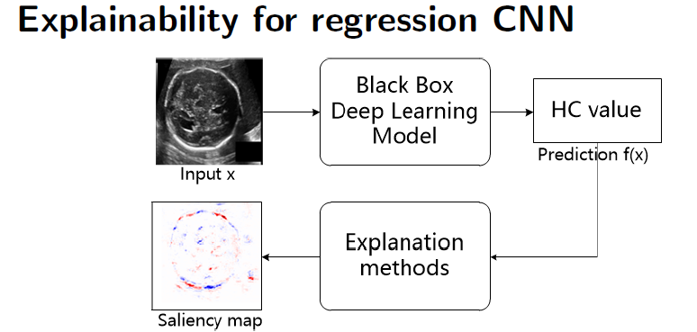

# XAI-reg
Explainability for regression CNN
---
    
⭐ The highlight of this work:
* Visualization of explanation methods via saliency maps (different explanation methods).
* Evaluation of explanation methods via perturbation-based method.
* Proposed adatped Area over Perturbation Curve (AOPC) metrics ([Samek et al. 2017 ](https://ieeexplore.ieee.org/abstract/document/7552539)) for regression.
* Comparison of regression models through qualitative (saliency maps) and quantitative (AOPC score) analysis.     
* Saliency maps for correct vs incorrect prediction.


💻 About the code:    

The code is implimented with Python 3.* and Deep learning library Tensorflow (Keras 2.*) and public library [iNNvestigate](https://github.com/albermax/innvestigate).

---
The work is finished together with [Caroline Petitjean](http://pagesperso.litislab.fr/cpetitjean/) and [Samia Ainouz](https://pagesperso.litislab.fr/sainouz/) in [LITIS](https://www.litislab.fr/) lab and [Florian Yger](http://www.yger.fr/).

Please consider citing this paper when you use it:


```
@incollection{zhang2020explainability,
  title={Explainability for regression CNN in fetal head circumference estimation from ultrasound images},
  author={Zhang, Jing and Petitjean, Caroline and Yger, Florian and Ainouz, Samia},
  booktitle={Interpretable and Annotation-Efficient Learning for Medical Image Computing},
  pages={73--82},
  year={2020},
  publisher={Springer}
}
```
